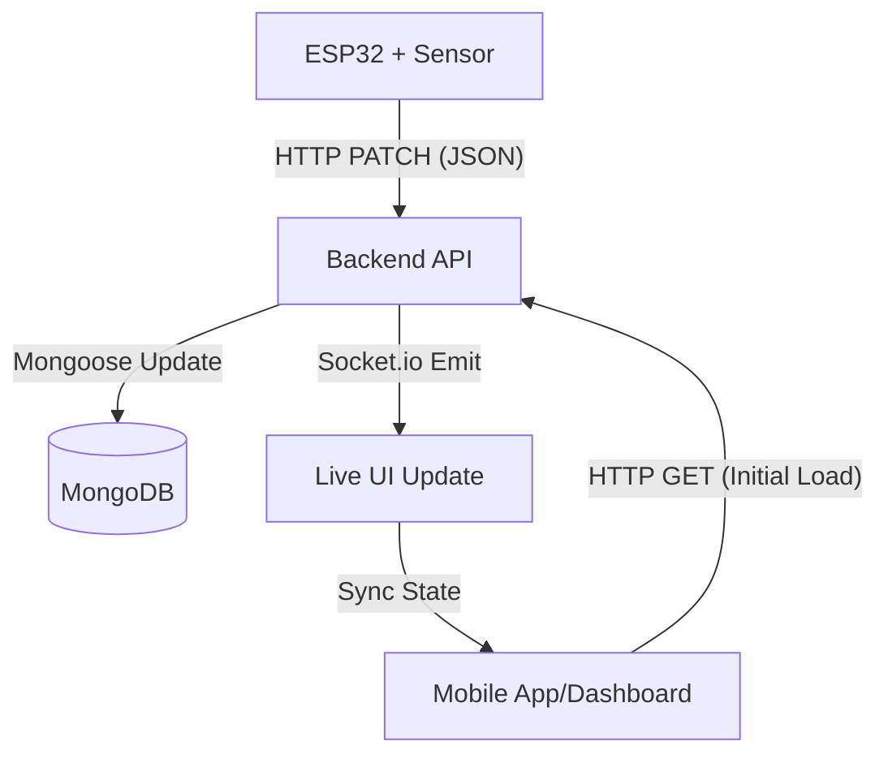

# Smart Waste Management: Data Flow Architecture

This document explains how the system captures waste level data from the hardware and displays it on your UI.

## 1. Hardware Layer (ESP32 + Ultrasonic Sensor)
The process starts at the bin:
*   **Sensing**: An ultrasonic sensor (HC-SR04) measures the distance from the top of the bin to the waste inside.
*   **Processing**: The ESP32 calculates the **Fill Level (%)** by mapping the measured distance against calibration limits (`MAX_DISTANCE` for empty, `MIN_DISTANCE` for full).
*   **Transmission**: Every 10 seconds, the ESP32 sends an HTTP `PATCH` request to your backend server.
    *   **Endpoint**: `http://<SERVER_IP>:5000/api/bins/BIN-001`
    *   **Payload**: `{"fillLevel": 85, "status": "Full"}`

## 2. Backend Layer (Express API + MongoDB)
The backend acts as the bridge:
*   **Receiving Data**: The `PATCH` route in [backend/routes/binRoutes.js](file:///c:/Users/DELL/OneDrive/Desktop/smart-waste-management/backend/routes/binRoutes.js) receives the data.
*   **Update Database**: It uses Mongoose to update the specific bin's record in **MongoDB**.
*   **Historical Logging**: It simultaneously saves a record in `BinHistory` to track trends over time.
*   **Real-time Broadcast**: The server uses **Socket.io** to emit a `binUpdate` event. This notifies any connected UI that a bin's status has changed *instantly*.

## 3. UI Layer (Mobile App & Dashboard)
How the UI shows you the data:
*   **Initial Fetch**: When you open the App/Dashboard, it makes a `GET /api/bins` request to see the current state of all bins.
*   **State Management**: React (or React Native) stores this list in a state variable (e.g., `bins`).
*   **UI Components**:
    *   **Markers/Cards**: The UI maps through the `bins` array and renders a card or map pin for each bin.
    *   **Visual Logic**: If a bin's `fillLevel` is > 80%, the UI dynamically changes the color to red and adds a "Needs Cleanup" badge (as seen in [explore.tsx](file:///c:/Users/DELL/OneDrive/Desktop/smart-waste-management/mobile/app/%28tabs%29/explore.tsx)).

## Summary Diagram

