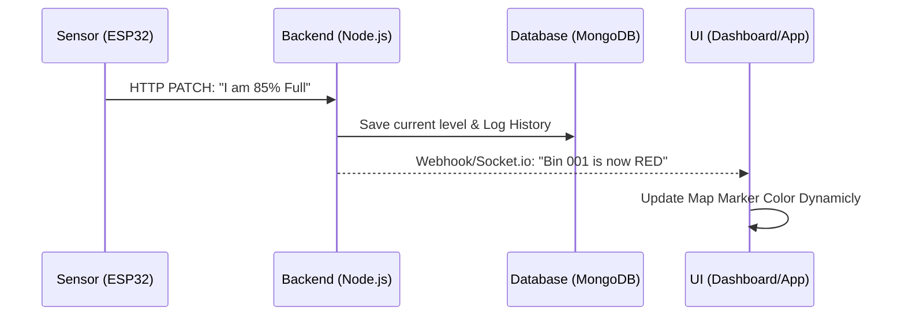
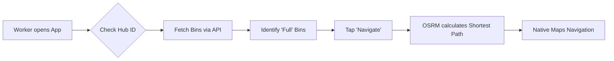

# 🚮 EcoSmart: Smart Waste Management System
### *Revolutionizing Urban Sanitation with IoT and Real-Time Data*

This guide is designed to help you explain your project to the judging panel. It breaks down the system into simple concepts, highlights innovative features, and provides clear data flow diagrams.

---

## 🌟 The Elevator Pitch
"Traditional waste collection is inefficient—trucks follow fixed routes regardless of whether bins are empty or overflowing. **EcoSmart** solves this by using **IoT-enabled bins** that report their fill levels in real-time. Our system optimizes collection routes, reduces fuel consumption, and provides city administrators with a bird's-eye view of urban sanitation health."

---

## 🛠️ Key Innovation Highlights
When talking to the judges, emphasize these **four "Killer Features"**:

1.  **Real-Time Intelligence**: Bins don't just "sit there"; they actively broadcast their status using Socket.io, allowing for instant dashboard updates without refreshing.
2.  **Smart Route Optimization**: Our mobile app uses the **OSRM (Open Source Routing Machine)** to calculate the most efficient walking/driving path to bins that actually need attention.
3.  **Predictive Readiness**: By logging historical data, the system identifies trends (e.g., bins near a park fill faster on weekends), enabling **proactive scheduling**.
4.  **Hardware-Cloud Synergy**: A seamless bridge between physical ESP32 sensors and a modern cloud-based React/Node.js stack.

---

## 🧬 System Architecture
Think of the project in three distinct layers:

### 1. The Sensing Layer (Hardware)
*   **Brain**: ESP32 Microcontroller.
*   **Eyes**: HC-SR04 Ultrasonic Sensor.
*   **Job**: Measures the gap between the bin lid and the trash. If the gap is small, the bin is full! It sends this data to the cloud every few seconds.

### 2. The Nervous System (Backend API)
*   **Stack**: Node.js, Express, MongoDB.
*   **Job**: The central hub. It receives sensor data, stores it securely in the database, and immediately "shouts" (broadcasts) the update to all connected apps.

### 3. The Visual Layer (Frontend & Mobile)
*   **Dashboard**: A React-based command center for administrators to see city-wide stats and trends.
*   **Worker App**: A React Native app for collection staff, featuring live maps and turn-by-turn navigation.

---

## 📊 Data Flow Diagrams

### Flow 1: From Bin to Dashboard (The Update Loop)
This diagram shows how a piece of trash becomes a red dot on a map.

### Flow 2: Worker Navigation (The Action Loop)
This shows how the system helps a worker save time.

---

## 💡 Quick Technical Talking Points (For the Tech Judge)
*   **Database**: We use **MongoDB** because its flexible document structure is perfect for sensor logs and varying bin metadata.
*   **Real-time UI**: **Socket.io** enables a "push" architecture. Instead of the browser asking "is it full yet?", the server tells the browser "it's full now!"
*   **Pathfinding**: We integrated **OSRM** for real-world coordinate-based navigation, ensuring workers don't waste time on empty bins.
*   **Scalability**: The system uses a **"Hub ID"** concept, allowing it to scale across multiple cities or districts independently.

---

## 🎯 Conclusion
"EcoSmart isn't just a sensor in a bin; it's a complete ecosystem that turns data into action, making our cities cleaner, greener, and more efficient."
