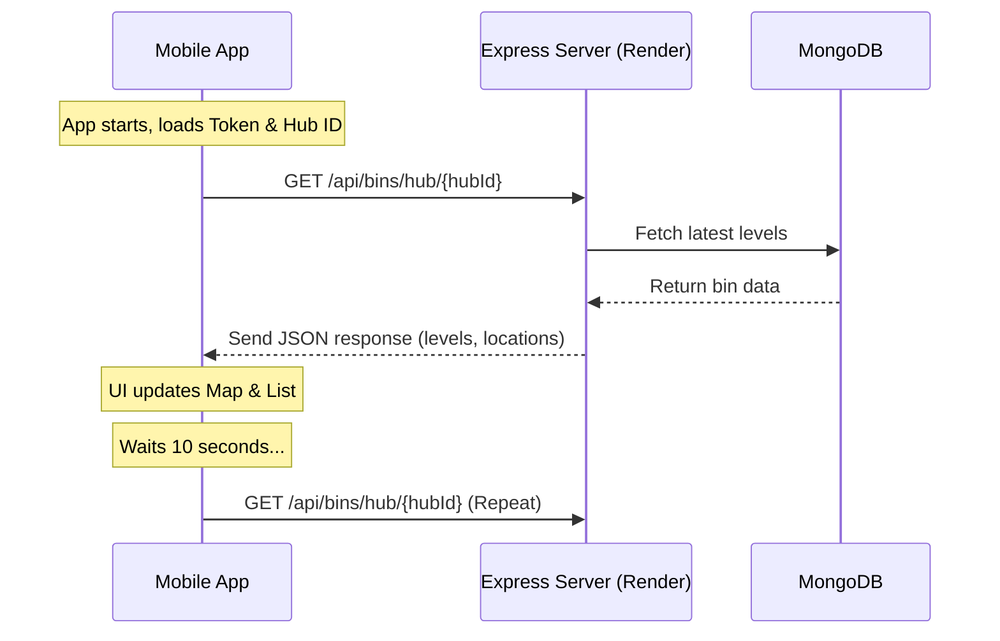

# Mobile-Backend Connection Overview

The connection between your mobile app and the backend server is established through several layers of configuration and communication protocols.

## 1. Centralized Configuration
The mobile app uses a central file to manage its connection settings:
- **File**: [Config.ts](file:///c:/Users/DELL/OneDrive/Desktop/smart-waste-management/mobile/constants/Config.ts)
- **URL**: It is currently set to use the **Live Render Server**: `https://smart-waste-api-epmw.onrender.com`
- **Toggle**: You can switch between local and live environments by changing `const IS_LOCAL = true/false;` in this file.

## 2. Authentication (Login & Register)
When you log in or register, the app makes standard HTTP requests:
- **Tool**: `axios` (a popular HTTP client).
- **Process**: 
  - Login: Sends a POST request to `${BASE_URL}/api/auth/login`.
  - Register: Sends a POST request to `${BASE_URL}/api/auth/register`.
- **Security**: Upon successful login, the server returns a **JWT Token**, which the app saves locally using `AsyncStorage` to keep you logged in.

## 3. Real-time Bin Updates (Polling)
To show the latest bin levels on the map and list:
- **Mechanism**: **HTTP Polling**. 
- **Frequency**: Every **10 seconds**, the app automatically asks the server for the latest bin data for your specific Hub ID.
- **Why Polling?**: While the backend supports WebSockets (Socket.io), the mobile app is currently configured to use periodic updates (polling) for simplicity and reliability across different network conditions.

## 4. Connection Flow Diagram

